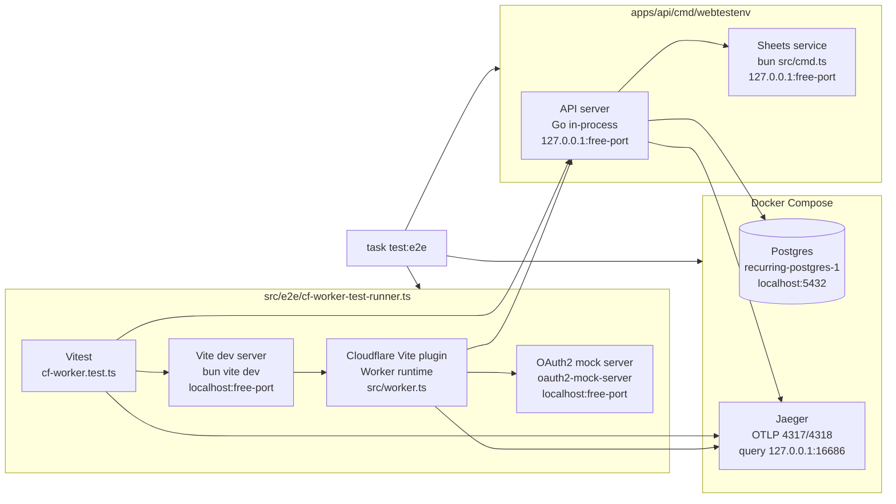

# `cf-worker.test.ts` Infra

`task test:e2e` wraps `apps/inertia/src/e2e/cf-worker.test.ts`
in short-lived services. The test process talks to the Worker through the Vite
dev HTTP origin, while the Worker gets Cloudflare-style bindings from
`wrangler.toml`, `.dev.vars.development`, and the wrapper's dynamic env vars.

Boot order:

- `compose:up-d` starts Postgres and Jaeger.
- `webtestenv` starts Sheets on a free localhost port, then starts the API on a
  free localhost port and exports `RECURRING_API_ORIGIN` to the wrapped command.
- `cf-worker-test-runner.ts` picks a free `RECURRING_WEB_ORIGIN`, starts
  `oauth2-mock-server.ts`, then starts `bun vite dev`.
- The runner passes `RECURRING_API_ORIGIN`, `RECURRING_WEB_ORIGIN`,
  `GOOGLE_AUTHORIZATION_ENDPOINT`, `GOOGLE_TOKEN_ENDPOINT`, and
  `GOOGLE_USERINFO_ENDPOINT` into Vite/Vitest.
- `vite.config.ts` injects those dynamic values as Worker vars when
  `RECURRING_CF_WORKER_TEST=1`; other Worker vars and secrets still come from
  `apps/inertia/wrangler.toml` and `.dev.vars.development`.
- After `/healthz` is ready on the Vite origin, the runner starts Vitest for
  `src/e2e/**/*.test.ts`.
