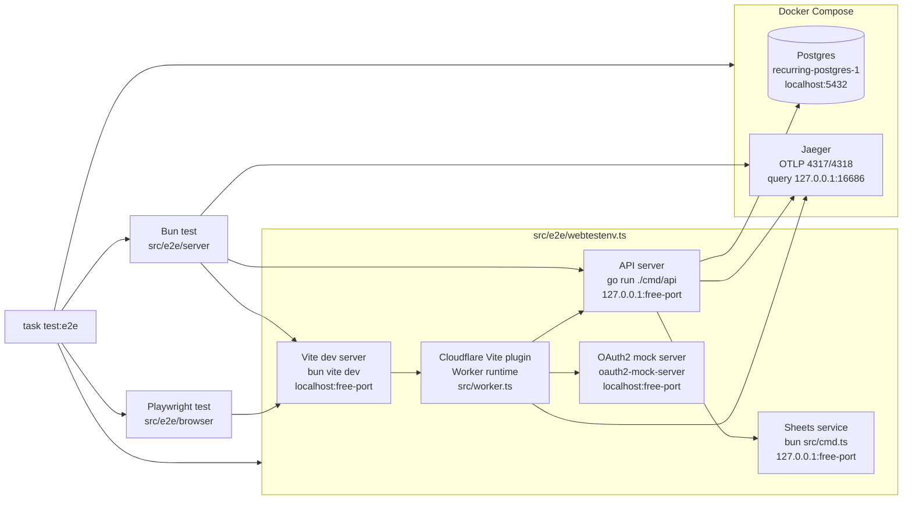

# E2E Infra

`task test:e2e` runs server and browser tests inside short-lived services.
The test processes talk to the Worker through the Vite dev HTTP origin, while
the Worker gets Cloudflare-style bindings from
`wrangler.toml`, `.dev.vars.development`, and the wrapper's dynamic env vars.

Boot order:

- `compose:up-d` starts Postgres and Jaeger.
- `webtestenv.ts` starts Sheets on a free localhost port, then starts the API
  with `go run ./cmd/api` on a free localhost port with a temporary config.
- `webtestenv.ts` picks a free `RECURRING_WEB_ORIGIN`, starts
  `oauth2-mock-server.ts`, then starts `bun vite dev`.
- `webtestenv.ts` passes `RECURRING_API_ORIGIN`, `RECURRING_WEB_ORIGIN`,
  `GOOGLE_AUTHORIZATION_ENDPOINT`, `GOOGLE_TOKEN_ENDPOINT`, and
  `GOOGLE_USERINFO_ENDPOINT` into Vite and the Taskfile test command.
- `vite.config.ts` injects those dynamic values as Worker vars when
  `RECURRING_CF_WORKER_TEST=1`; other Worker vars and secrets still come from
  `apps/inertia/wrangler.toml` and `.dev.vars.development`.
- After `/healthz` is ready on the Vite origin, `webtestenv.ts` starts the
  command supplied by `Taskfile.yaml`: `bun test src/e2e/server`, then
  `bun playwright test`.
